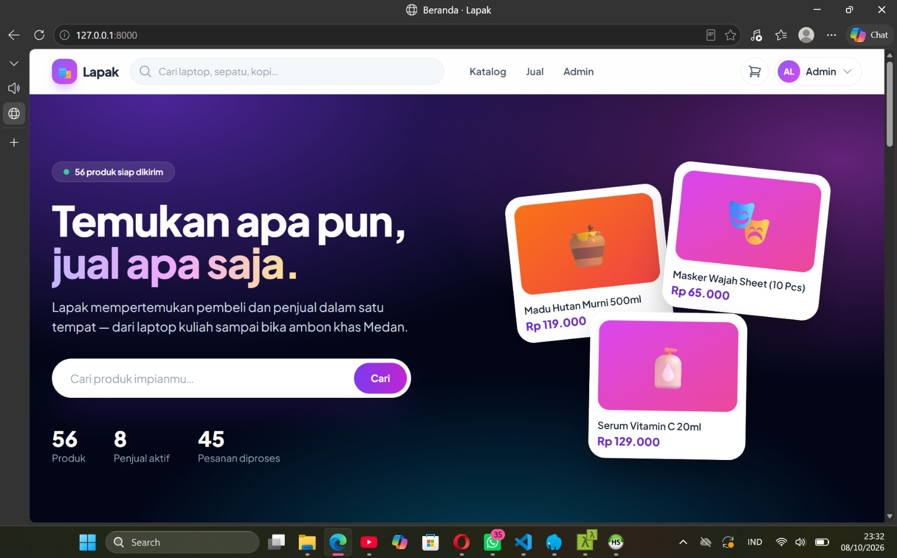
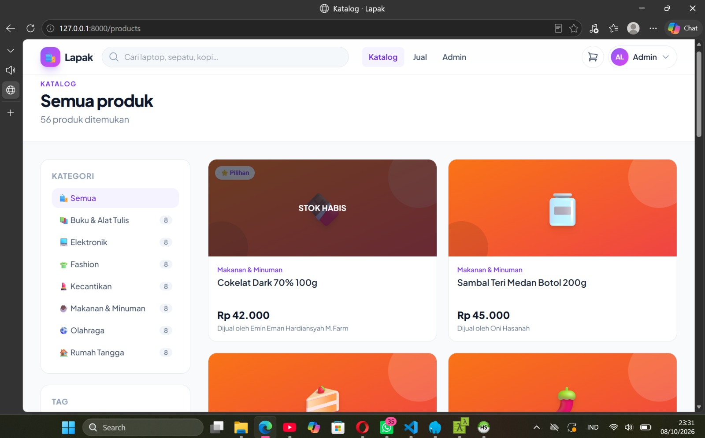
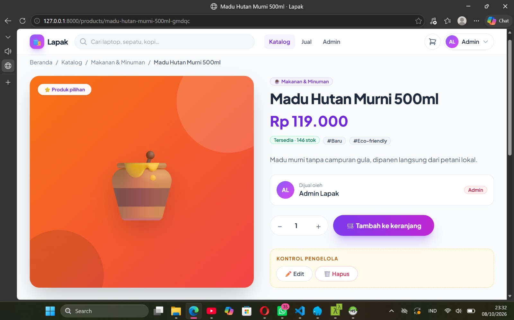
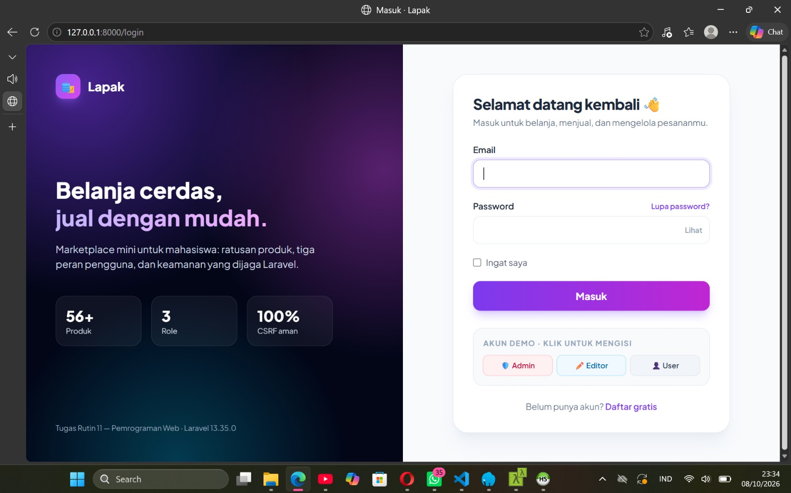
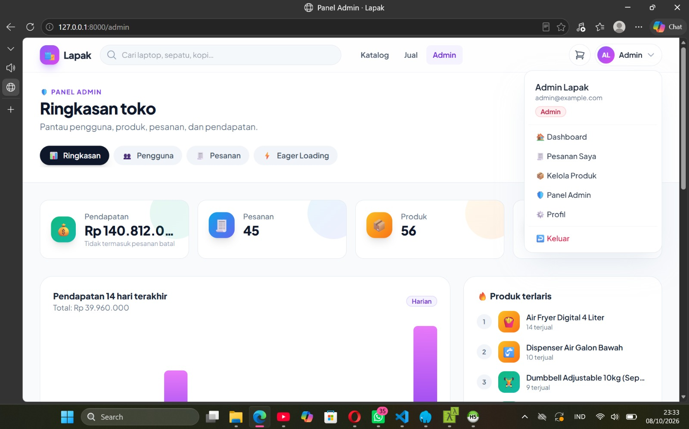
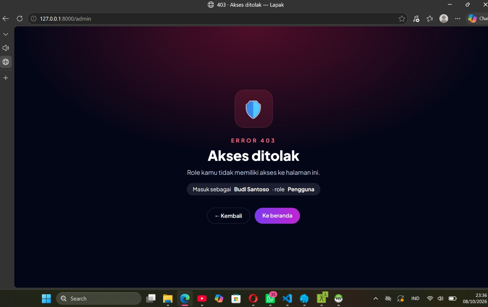
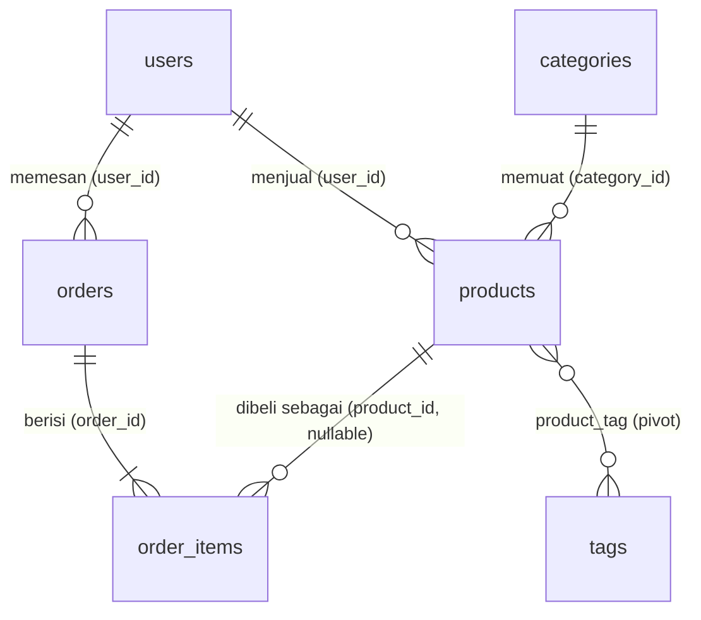

# 🛍️ Lapak — E-Commerce DB + Secure Auth

Marketplace mini berbasis **Laravel + Breeze** untuk **Tugas Rutin 11** mata kuliah Pemrograman Web (3KOM40115) — Pertemuan 11: Migrations, Eloquent, Auth & Middleware.

> **Nama: Nazla Muthia** **NIM:** _4253250052_

## Screenshot

| Beranda           | Katalog + filter        | Detail produk         |
| ----------------- | ----------------------- | --------------------- |
|  |  |  |

| Login               | Panel admin         | 403 (uji role)  |
| ------------------- | ------------------- | --------------- |
|  |  |  |

### Bukti Tinker 5 Query


- Product::count() = 56 (50+ requirement)
- User admin = 1
- with('user') = Relationship + Eager Loading
- where is_featured = 12
- where price > 5jt = 1

## Checklist Requirement

### Bagian A — Database & Eloquent

| # | Requirement                                | Implementasi                                                                                                                                                                                                              |
| - | ------------------------------------------ | ------------------------------------------------------------------------------------------------------------------------------------------------------------------------------------------------------------------------- |
| 1 | Migrations 7 tabel + FK constraints        | `database/migrations/` — `users` (+kolom `role`), `categories`, `tags`, `products`, `product_tag`, `orders`, `order_items`. FK memakai `cascadeOnDelete`, `restrictOnDelete`, dan `nullOnDelete` |
| 2 | Seeders + factories (50+ produk realistis) | `database/seeders/` & `database/factories/` — **56 produk** (7 kategori × 8), 15 user, 45 pesanan                                                                                                             |
| 3 | Model + relationships + minimal 1 scope    | `app/Models/` — `hasMany`, `belongsTo`, `belongsToMany`; scope `inStock`, `featured`, `search`, `inCategory`, `withTag`, `priceBetween`                                                              |
| 4 | Dokumentasi 5 query Tinker                 | [`docs/tinker-queries.md`](docs/tinker-queries.md)                                                                                                                                                                       |

### Bagian B — Auth & Security

| # | Requirement                       | Implementasi                                                                                                                                         |
| - | --------------------------------- | ---------------------------------------------------------------------------------------------------------------------------------------------------- |
| 5 | Breeze (login/register/logout)    | `laravel/breeze` (stack Blade); halaman login & register didesain ulang                                                                            |
| 6 | Multi-role + custom middleware    | Kolom`users.role` (`admin`/`editor`/`user`), `app/Http/Middleware/EnsureUserHasRole.php`, alias `role` → `->middleware('role:admin')` |
| 7 | Policy edit/delete                | `app/Policies/ProductPolicy.php` (+ `OrderPolicy`), dipanggil lewat `Gate::authorize()` di controller dan `@can` di Blade                    |
| 8 | Route protection + testing 2 role | `routes/web.php` (`auth`, `role:admin`), checklist uji di bawah, dan test otomatis `tests/Feature/AccessControlTest.php`                     |

> **Catatan penamaan:** pada soal tertulis *PostPolicy*, tetapi domain e-commerce tidak punya `Post` — resource yang dimiliki user adalah **Product**. Karena itu policy-nya bernama `ProductPolicy` dengan aturan yang sama seperti contoh slide (pemilik atau editor boleh edit).

**Bonus:** demo eager loading (halaman `/admin/eager-loading` + deteksi N+1 di `AppServiceProvider`), keranjang & checkout dengan database transaction, dashboard admin. Filament: lihat bagian *Bonus Filament*.

## Skema Database



## Role & Hak Akses

| Kemampuan                                           | user | editor | admin |
| --------------------------------------------------- | :--: | :----: | :---: |
| Belanja, checkout, lihat pesanan sendiri            |  ✅  |   ✅   |  ✅  |
| Tambah produk, edit & hapus**produk sendiri** |  ✅  |   ✅   |  ✅  |
| **Edit** produk milik orang lain              |  ❌  |   ✅   |  ✅  |
| **Hapus** produk milik orang lain             |  ❌  |   ❌   |  ✅  |
| Menandai produk "pilihan" (`is_featured`)         |  ❌  |   ✅   |  ✅  |
| Panel`/admin` (pengguna, pesanan, eager loading)  |  ❌  |   ❌   |  ✅  |

## Cara Install

Prasyarat: PHP ≥ 8.2, Composer, MySQL aktif (Laragon/XAMPP). **Node/npm tidak diperlukan** — tampilan memakai Tailwind & Alpine via CDN (butuh koneksi internet saat membuka halaman).

```bash
# 1. Project baru + Breeze
composer create-project laravel/laravel TugasWeb-P11-EcommerceAuth
cd TugasWeb-P11-EcommerceAuth
composer require laravel/breeze --dev
php artisan breeze:install blade      # jawab prompt sesukamu (dark mode / testing framework)
```

**2.** Buat database `lapak_db` di phpMyAdmin (collation `utf8mb4_unicode_ci`).

**3.** Ubah `.env`:

```env
APP_NAME=Lapak
APP_FAKER_LOCALE=id_ID      # nama & alamat acak berbahasa Indonesia

DB_CONNECTION=mysql
DB_HOST=127.0.0.1
DB_PORT=3306
DB_DATABASE=lapak_db
DB_USERNAME=root
DB_PASSWORD=
```

**4.** Salin **semua file dari repo ini ke project, timpa file bawaan** (Breeze harus terpasang lebih dulu karena file overlay menggantikan `routes/web.php`, layout, dan beberapa view Breeze).

```bash
# 5. Buat 7 tabel + isi data
php artisan migrate:fresh --seed

# 6. Jalankan
php artisan serve        # http://127.0.0.1:8000
```

### Akun demo (password: `password`)

| Role        | Email                  |
| ----------- | ---------------------- |
| 🛡️ Admin  | `admin@example.com`  |
| ✏️ Editor | `editor@example.com` |
| 👤 User     | `user@example.com`   |

Di environment `local`, halaman login menyediakan tombol *Akun demo* untuk mengisi form otomatis.

## Testing 2 Role (incognito)

Buka **dua jendela berbeda**: jendela biasa untuk satu akun, jendela *incognito* untuk akun lain (session tidak tercampur).

| # | Skenario                                                                               | Hasil yang diharapkan                                                      |
| - | -------------------------------------------------------------------------------------- | -------------------------------------------------------------------------- |
| 1 | Guest membuka`/manage/products`, `/cart`, `/admin`                               | Redirect ke`/login`                                                      |
| 2 | **user** membuka `/admin`                                                      | **403** (halaman error khusus)                                       |
| 3 | **editor** membuka `/admin`                                                    | **403**                                                              |
| 4 | **admin** membuka `/admin`                                                     | Dashboard tampil                                                           |
| 5 | **user** membuka tautan edit milik produk orang lain (salin dari jendela editor) | **403** — walau tombolnya disembunyikan, URL langsung tetap ditolak |
| 6 | **editor** mengedit produk milik user                                            | Berhasil; tombol**Hapus** tidak muncul, `DELETE` manual → 403     |
| 7 | **admin** menghapus produk siapa pun                                             | Berhasil                                                                   |
| 8 | Register akun baru dengan menambah field`role=admin` lewat DevTools                  | Akun tetap berperan`user` (mass assignment dilindungi)                   |
| 9 | Admin mengubah role di`/admin/users`, lalu login ulang sebagai akun itu              | Hak akses mengikuti role baru                                              |

Versi otomatis:

```bash
php artisan test --filter=AccessControlTest
```

> Test memakai database di `phpunit.xml` (bawaan Laravel: SQLite in-memory, butuh ekstensi `pdo_sqlite`).

## Keamanan yang Diterapkan

| Ancaman             | Pertahanan di proyek ini                                                                                               |
| ------------------- | ---------------------------------------------------------------------------------------------------------------------- |
| Akses ilegal        | Middleware`auth` + `role:*` + Policy + Gate; otorisasi di **server**, bukan hanya menyembunyikan tombol      |
| Mass assignment     | `User::$fillable` tanpa `role`; `Product` tanpa `user_id`/`slug`/`is_featured`; `Order` tanpa `status` |
| SQL injection       | Eloquent / query builder (parameter binding), filter diambil lewat whitelist                                           |
| XSS                 | Blade`{{ }}` auto-escape                                                                                             |
| CSRF                | `@csrf` di semua form + `@method('PATCH'/'DELETE')`                                                                |
| Password bocor      | `Hash` otomatis (cast `hashed`)                                                                                    |
| Brute force login   | Rate limiter bawaan Breeze                                                                                             |
| Race condition stok | Checkout dalam`DB::transaction` + `lockForUpdate()`                                                                |
| Integritas data     | FK constraint di level database (`cascade` / `restrict` / `nullOnDelete`)                                        |

## Bonus Filament (opsional)

```bash
composer require filament/filament
php artisan filament:install --panels
php artisan make:filament-user

# manajemen role & permission otomatis
composer require bezhansalleh/filament-shield
php artisan shield:install --all
```

Agar panel Filament hanya bisa dibuka admin di production, implementasikan `FilamentUser` pada `User`:

```php
use Filament\Models\Contracts\FilamentUser;
use Filament\Panel;

class User extends Authenticatable implements FilamentUser
{
    public function canAccessPanel(Panel $panel): bool
    {
        return $this->isAdmin();
    }
}
```

## Struktur Penting

```
app/
├── Http/Controllers/        Home, Product, Cart, Order, Dashboard, Admin/*
├── Http/Middleware/EnsureUserHasRole.php
├── Http/Requests/           ProductRequest, CheckoutRequest
├── Models/                  User, Category, Product, Tag, Order, OrderItem
├── Policies/                ProductPolicy, OrderPolicy
└── Providers/AppServiceProvider.php   alias middleware, Gate, @rupiah, deteksi N+1
database/{migrations,factories,seeders}
resources/views/             layouts, components, auth, products, cart, orders, admin, errors
routes/web.php
tests/Feature/AccessControlTest.php
docs/tinker-queries.md
```

* [ ] Troubleshooting

- **Tampilan polos / tanpa gaya** → perangkat tidak punya internet (Tailwind & Alpine dimuat dari CDN).
- **`Class "Database\Factories\..." not found` / `Unknown column 'role'`** → jalankan `php artisan migrate:fresh --seed`.
- **`Table 'sessions' doesn't exist`** → jalankan `php artisan migrate`.
- **Login dengan akun demo gagal** → pastikan seeder sudah dijalankan; password semua akun adalah `password`.
- **Halaman 403 tidak tampil gaya khusus** → jalankan `php artisan view:clear`.
- **Mengulang dari awal** → `php artisan migrate:fresh --seed`.
- Log deteksi N+1 ada di `storage/logs/laravel.log` (awalan `[N+1]`).
